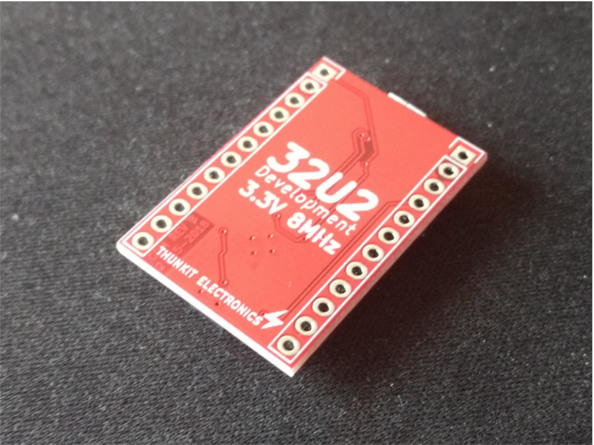

# About #

Development board based on the ATmega32U2 MCU. Uses Atmel's DFU bootloader.

# Hardware History #

## REV A ##
- Initial Design

## REV B ##
| Front | Back|
| ------------------------------------------ | ----------------------------------------- |
|   |   |
- Added power and blink LED to the board
