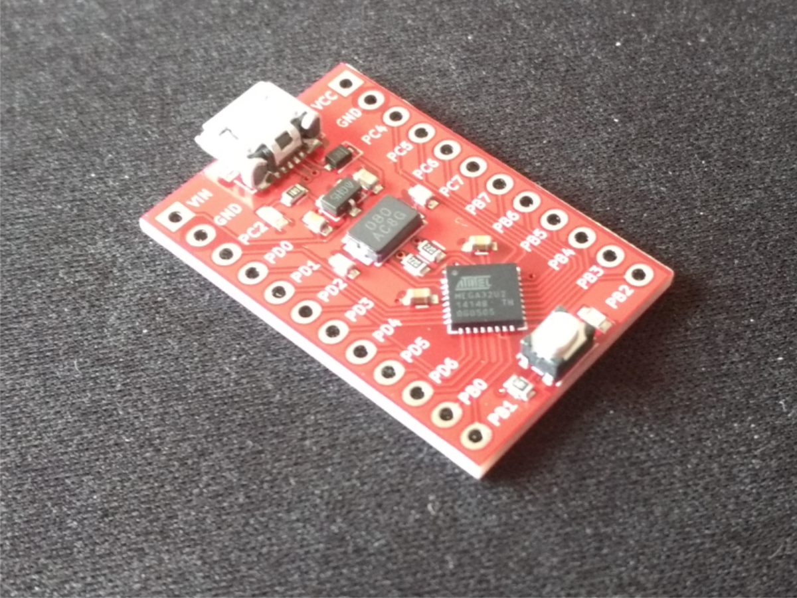

# About #

Thunkit Electronics sells electronic kits for hobbyists and engineers alike. Available at [thunkitelectronics.com](https://thunkitelectronics.com) and [Tindie](https://www.tindie.com/stores/cmccaskey). All designs are open source with schematics, board layouts, code, and BOMs freely available.

## Description ###
  
The ATmega 32U2-Development is a microcontroller development board based around the Atmel ATmega32u2. The ATmega32u2 is a smaller version of the ATmega32u4 used on similar small form development boards. The ATmega32u2 is a great chip to use when a small, low cost, and powerful AVR MCU is needed. The ATmega32u2 comes from the factory with Atmel's DFU USB bootloader. Together the ATmega32u2-Development with avr-gcc and dfu-programmer makes for a great Open Source AVR development experience. C code is also simple to write for this MCU and together with LUFA (USB stack) the USB can be used to emulate numerous devices and interfaces. Note: the male headers do not come pre-soldered to the board.

## Schematic ##

## Bill of Material ##
[Available Here](IMAGES/32U2-DEV_BOM.html)

## Blink Code ##
[Available Here](FIRMWARE/BLINK/BLINK.c)

## Upload Makefile ##
[Available Here](FIRMWARE/BLINK/makefile)
