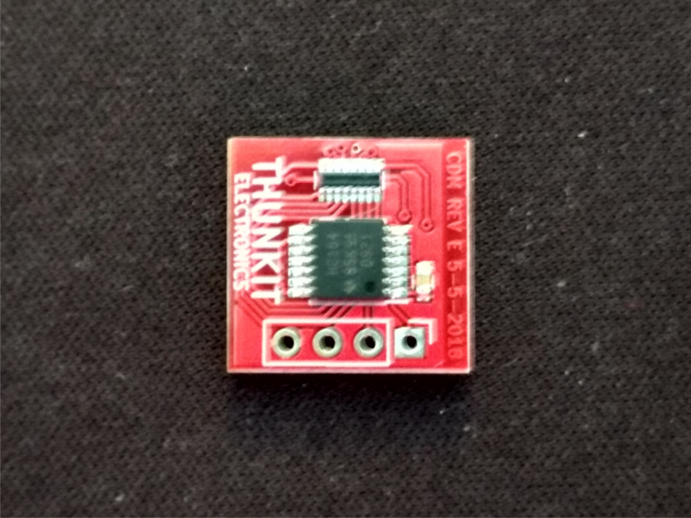

# About #

SPI visualizer using 8 bit shift registerds and LEDs

# Hardware History #

## REV A ##
- First design
- Utilized 74HC595 for SPI
- Misc. issues

## REV B ##
- Utilized 74HC595 for SPI
- Misc. issues

## REV C ##
- Utilized 74HC595 for SPI
- First working board that used the 74HC595, however the MSB and LSB were backwards

## REV D ##
- Utilized 74HC164 for SPI without CS
- Only 8 bits. The data line can be connected to either MOSI or MISO.
- Tested working but labeled to do I2C which is not accurate, it only does SPI
- KiCAD files reflect the label change without a new revision

## REV E ##
| Front | Back|
| ------------------------------------------ | ----------------------------------------- |
|   |   |
- Updated package for the shift register
