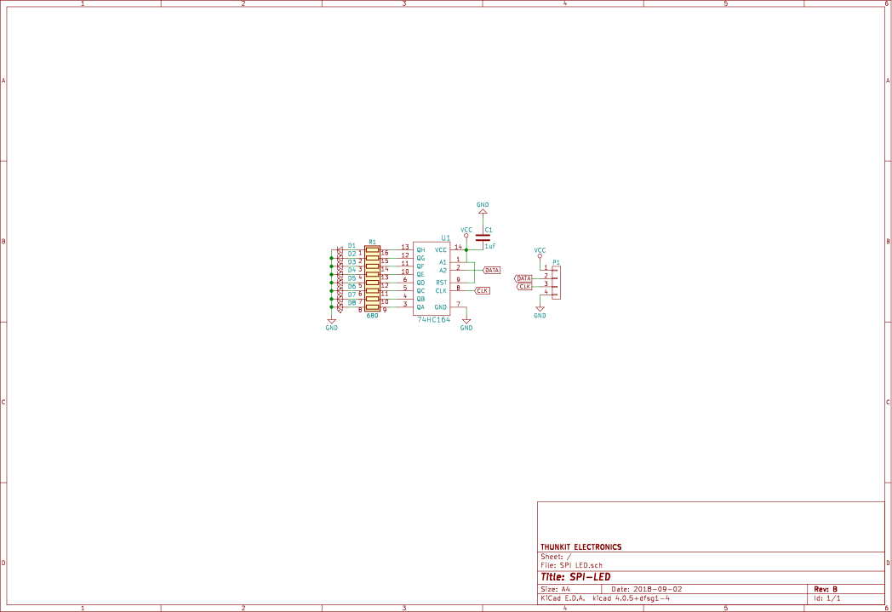

# About #

Thunkit Electronics sells electronic kits for hobbyists and engineers alike. Available at [thunkitelectronics.com](https://thunkitelectronics.com) and [Tindie](https://www.tindie.com/stores/cmccaskey). All designs are open source with schematics, board layouts, code, and BOMs freely available.

## Description ###
  
The SPI-LED is a useful tool for SPI debugging without the use of an oscilloscope. This board is to be wired into MOSI or MISO and SCK and will display on the 8 LEDs on the fron what data is being transferred on that line. With a few delay statements in your program, it is possible to slow the SPI transfers down slow enough that you can visually see whats happening. Since this board does not require a chip select, a single board can be used to monitor MOSI or MISO on your project without requiring a board for each connected device. Additionally, this board can be used in your project if you need a simple 8 bit bar graph to use as an indicator.

## Device ##
This board is based around the 74HC624 shift register. Because of this, this board can be used to debug logic levels ranging from 2 to 6V. Red LEDs allow the board to function down to 2V because of their low forward voltage. Note: the male headers do not come pre-soldered to the board.

## Schematic ##

## Bill of Material ##
[Available Here](IMAGES/SPI-LED_BOM.html)

## Code Example ##
[Available Here](FIRMWARE/SPI-LED/SPI-LED.ino)
