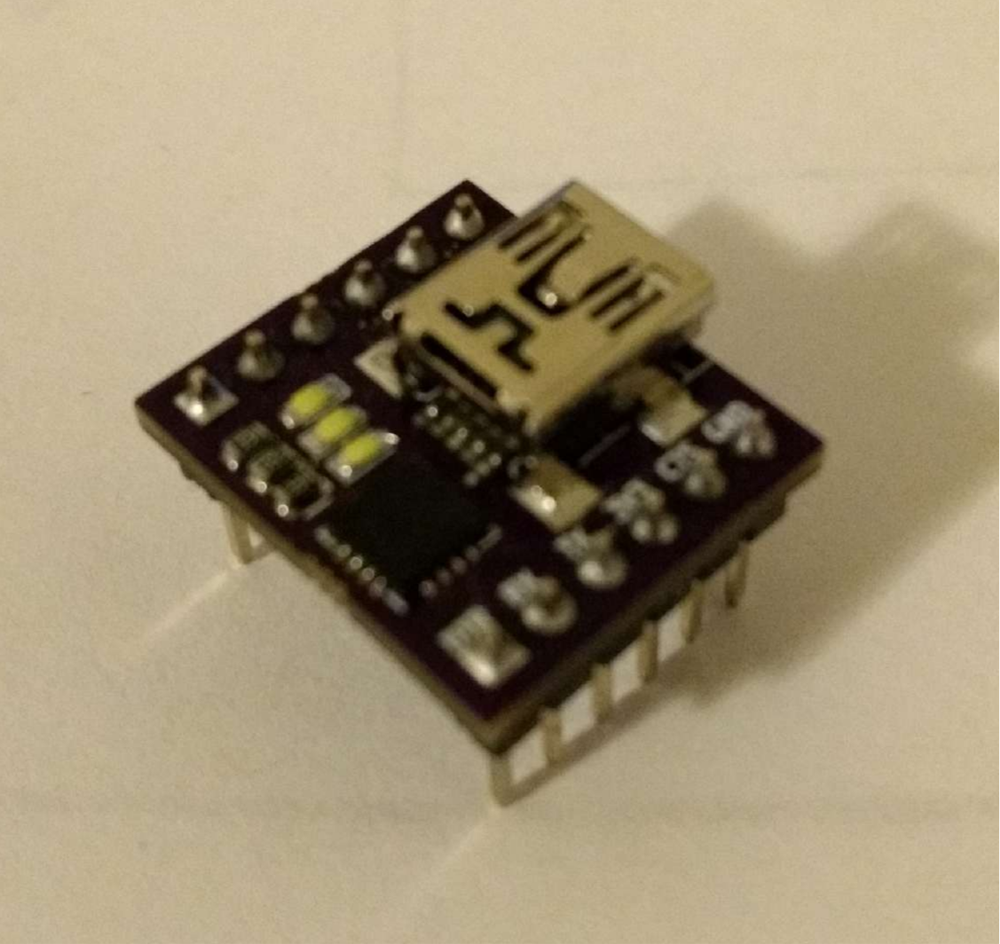
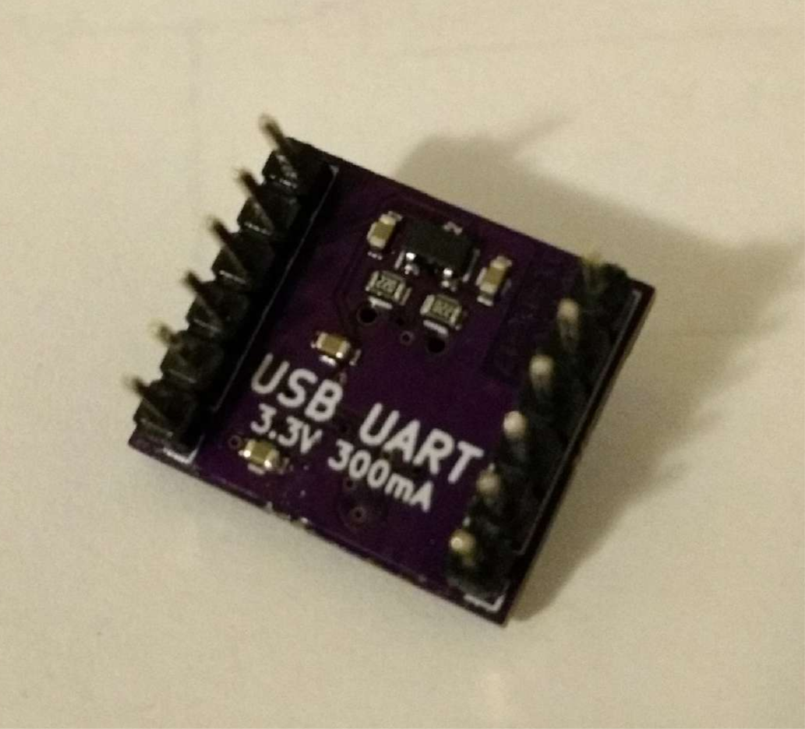
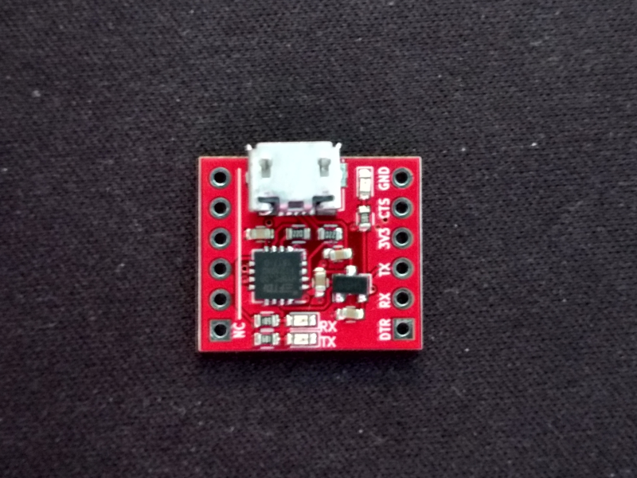
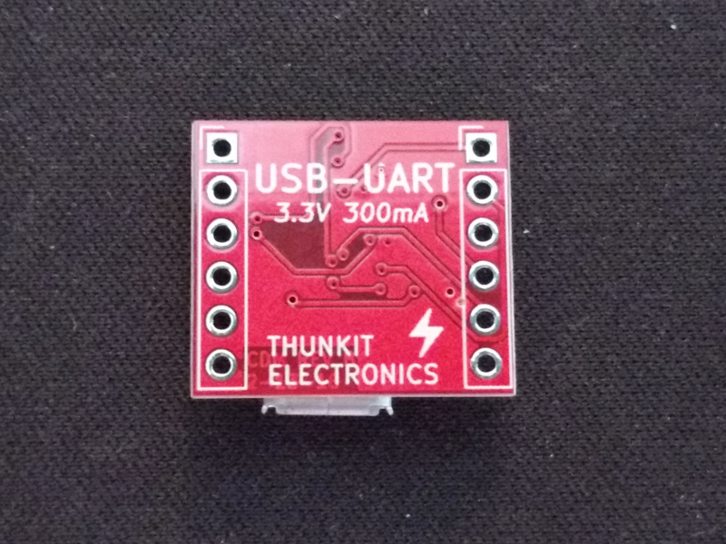

# About #

This is a FT230X based USB to serial adapter with an integrated 3.3V LDO regulator.

# Hardware History #

## REV A ##
| Front | Back|
| ------------------------------------------ | ----------------------------------------- |
|   |   |
- First Design
- Used Mini USB connector
- Parts on both sides

## REV B ##
| Front | Back|
| ------------------------------------------ | ----------------------------------------- |
|   |   |
- Used smaller and cheaper Micro USB connector
- Parts on only one side for easier assembly
- Fixed RX TX LED polarity and labeled them
