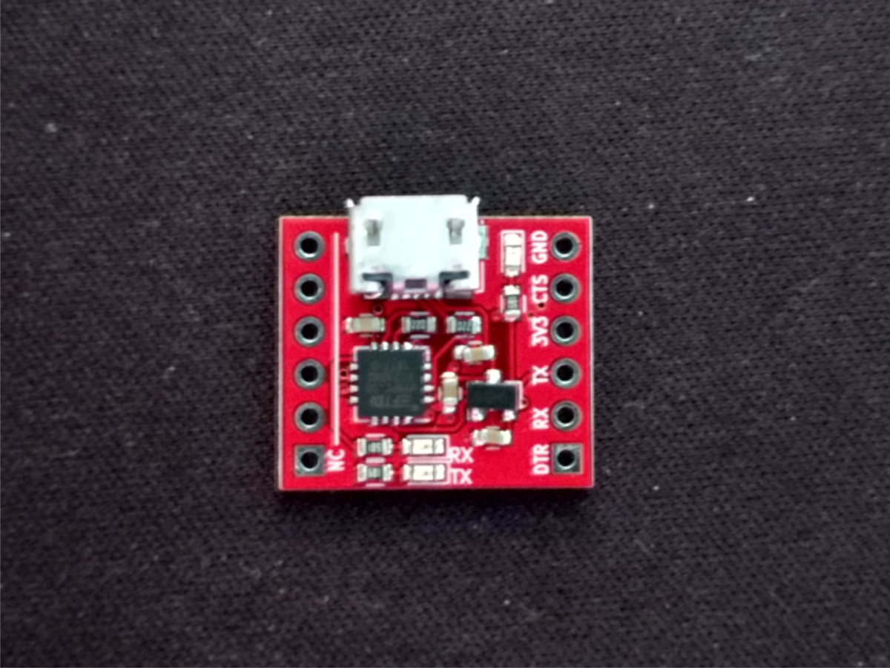
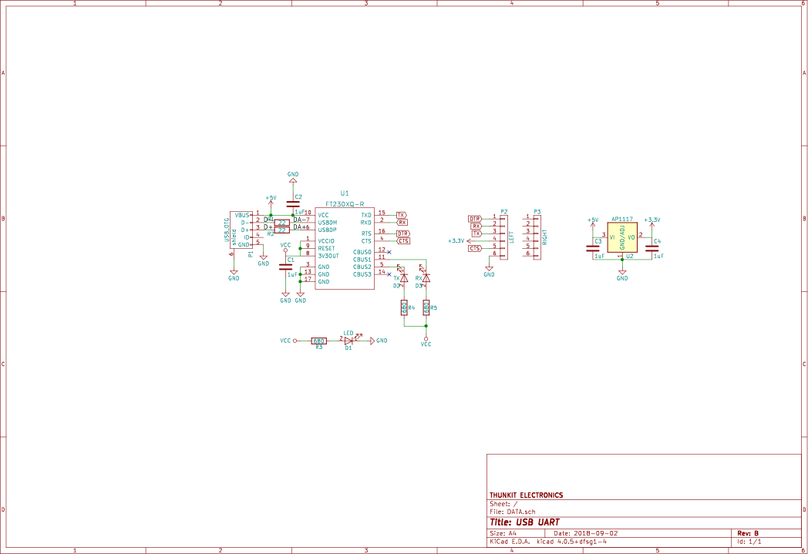

# About #

Thunkit Electronics sells electronic kits for hobbyists and engineers alike. Available at [thunkitelectronics.com](https://thunkitelectronics.com) and [Tindie](https://www.tindie.com/stores/cmccaskey). All designs are open source with schematics, board layouts, code, and BOMs freely available.

## Description ###
  
The USB-UART is a great USB to UART adapter for your electronics projects. It boasts 3.3V only operation with a built in LDO regulator that can output up to 300mA at 3.3V. The built in regulator is a clear advantage over most other FTDI boards that can only output a few mA on the built in voltage regulator. Included on the board is a power LED as well as RX and TX LEDs. The pinout follows the common FTDI cable pinout and a second row of headers allows the board to be stable when plugged into a breadboard. Note: the male headers do not come pre-soldered to the board. Also note that the RX and TX LEDs indicate RX and TX relative to the PC.

## Schematic ##

## Bill of Material ##
[Available Here](IMAGES/USB-UART_BOM.html)
